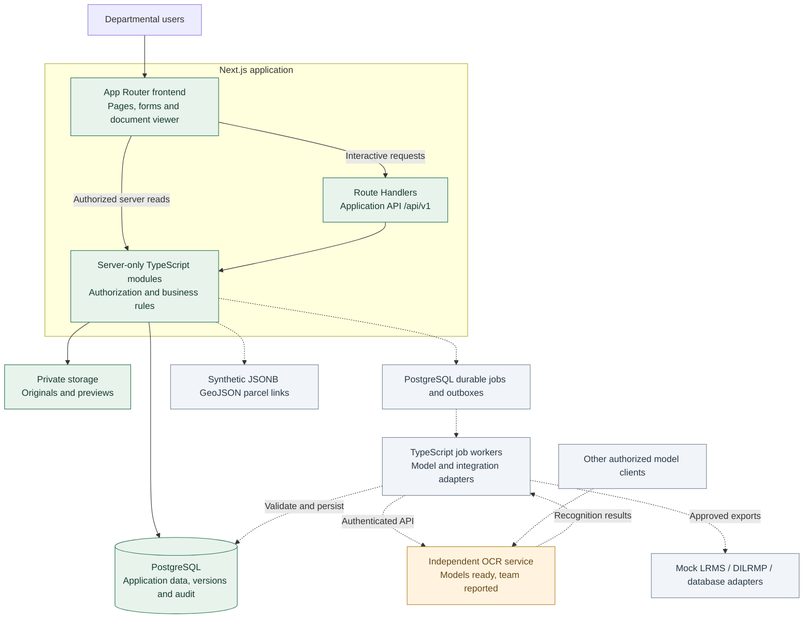
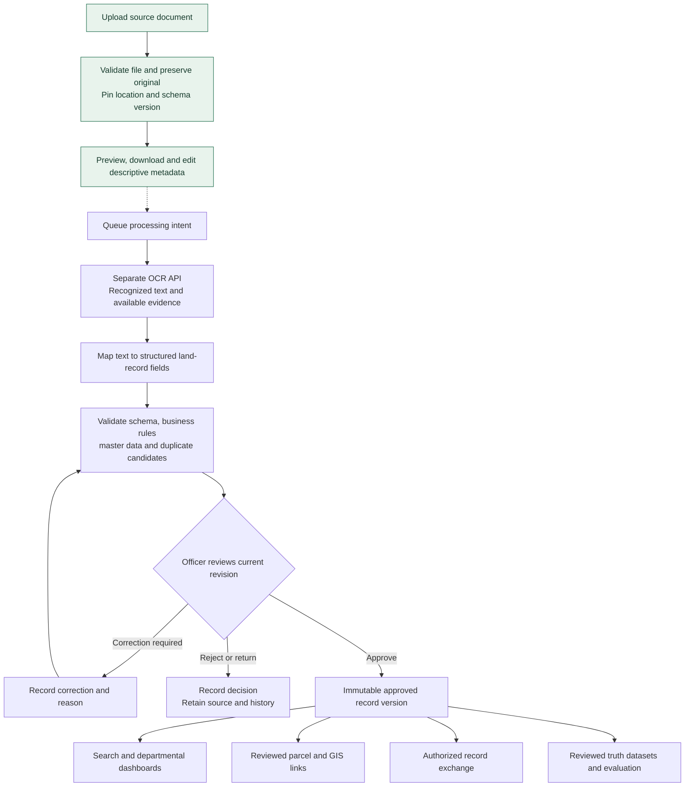
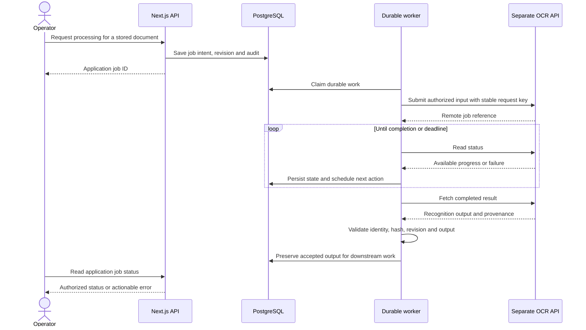

<div align="center">

**TEAM SANGANAK · SIH26018**

# Intelligent Land Record Digitization<br/>and Validation System

### Preserve the source. Assist transcription. Verify every record.

**Next.js frontend + backend · PostgreSQL · Separate OCR model API**

[Overview](#project-overview) · [Architecture](#system-architecture) · [Workflow](#document-to-record-workflow) · [Modules](#modular-structure) · [Status](#development-status) · [Setup](#run-locally) · [SIH presentation](SIHPPT.md)

</div>

---

> **Application:** Phases 1–6 are implemented and verified; Phases 7–9 are implemented with tests deferred. **OCR:** the team reports its trained models are ready in the independent model project; connect them through the Phase 3 HTTP adapter. Government exchange is implemented as labelled in-process mocks only; live integration remains future work. Dashboard accuracy is explicitly unmeasured until Phase 10 evaluation data exists.

## Project overview

Land departments work with scanned registers, handwritten entries, multilingual documents and inconsistent historical formats. A useful digital record must retain the source evidence, identify uncertainty and make corrections and approval traceable.

This project combines a secure document workspace with an OCR-assisted digitization and verification workflow. **Next.js provides both the user interface and application backend. PostgreSQL stores application records and history. A separately deployed OCR service provides recognition through an API.**

The goal is to reduce repetitive transcription while keeping officers responsible for verifying records. Source documents, recognized text, field evidence, corrections and approved versions are designed to remain connected throughout the record lifecycle.

| Capability | Purpose | Current position |
|---|---|---|
| Identity and scoped access | Restrict departmental and jurisdiction access | Implemented |
| Document repository | Preserve originals, previews, metadata and history | Implemented |
| Administrative hierarchy | Organize state → district → tehsil → village | Implemented |
| Document-type schemas | Configure expected fields and retain schema versions | Implemented |
| OCR-assisted capture | Recognize printed and handwritten source text | Separate model API boundary implemented; live OCR connection pending |
| Structured extraction | Map recognized content to land-record fields | Application ingestion implemented; live model connection pending |
| Validation and duplicate review | Surface inconsistencies and candidate matches | Implemented |
| Officer verification | Review evidence, correct values and approve revisions | Implemented |
| Records and search | Retrieve approved records, owners, history and scoped search | Implemented |
| GIS parcel links | Review cadastral sources and parcel links | Implemented with synthetic JSONB GeoJSON |
| Government integrations | Export exact approved versions with acknowledgements | Mock adapters implemented; live exchange pending |
| Dashboard | Track scoped workflow, validation, confidence, errors and jurisdiction progress | Implemented; accuracy unmeasured |
| Feedback | Evaluate model results with reviewed truth pairs | Planned |

The supplied brief identifies problem **26018**, *Intelligent Land Record Digitization and Validation System*. The supplied SIH format names **Sanganak**, **Smart Automation**, and **Software**. Presentation-specific content is maintained separately in [SIHPPT.md](SIHPPT.md).

## System architecture

The application is a modular Next.js system. Business services enforce authorization for both frontend server reads and backend API requests. The model remains independently deployed and reusable by other authorized clients.



**Diagram key:** solid connections represent the implemented application path; dashed connections represent planned integration. Model readiness does not mean the application already performs OCR.

| Boundary | Owns |
|---|---|
| Next.js application | UI, sessions, permissions, APIs, schemas, workflow and business policy |
| PostgreSQL | Relational data, metadata revisions, immutable history and audit |
| Private storage | Original file bytes and derived previews |
| Future application worker | Durable submission, polling, retries and validated result ingestion |
| Separate model project | Model training, weights, inference implementation and recognition service |

## Document-to-record workflow



The green steps are available today. Processing and all downstream decisions are planned. **Recognition confidence never equals approval.** Human review must resolve blockers and approve an exact revision; corrections must preserve earlier values and evidence.

Target fields include owner details, survey/khasra/khata identifiers, area and units, administrative location, classification, ownership, mutation and registration information. Required fields depend on the selected document type and applicable rules.

## OCR readiness and application integration

The team has prepared its OCR models in a separate project. The previously supplied model notes inform this integration boundary; training recipes, classifier internals and standalone benchmark figures are not duplicated here.

| Ready outside this repository | Still required in this application |
|---|---|
| Trained OCR models, reported by the team | Confirm deployed endpoint, authentication and supported request/result format |
| Independently maintained recognition implementation | Implement the versioned API adapter and durable job lifecycle |
| Model-side development can continue separately | Validate response identity, input hash, schema and document revision |
| Recognition output can support downstream work | Implement field mapping, validation, evidence review and approval |

The following sequence is the **proposed application integration**, to be aligned with the actual service API. It does not assert that the deployed OCR endpoint already supports this job protocol.



Stable request keys and persistent jobs must prevent duplicate logical work and survive browser disconnects. Late results must not overwrite newer revisions. The model receives no application database credentials and has no authority to approve records. See the [proposed model API contract](docs/MODEL_API_CONTRACT.md).

## Modular structure

Each domain owns its safe contracts, server services and UI. Routes remain thin; browser components never import database clients, credentials or server services.

| Area | Modules | Responsibility |
|---|---|---|
| Access and configuration | `identity`, `master-data`, `document-types` | Accounts, permissions, hierarchy and schema versions |
| Intake and processing | `documents`, `processing` | Source files, previews, metadata, jobs and recognition history |
| Quality and review | `validation`, `duplicates`, `verification` | Rules, candidate matches, corrections and approval |
| Records and exchange | `land-records`, `gis`, `integrations` | Approved versions, search, spatial links and external exchange |
| Oversight and improvement | `feedback`, `dashboard`, `audit` | Evaluation datasets, operational metrics and action history |

```text
Land_dizitization/
├── README.md                    Complete project guide
├── SIHPPT.md                    SIH presentation content
├── AGENTS.md                    Development instructions
├── MASTER_PROJECT_PROMPT_SIH26018.md
├── SIH26018 Master AI Project Prompt.md
├── src/
│   ├── app/                     Next.js pages and /api/v1 Route Handlers
│   ├── modules/                 14 domain modules
│   │   └── <module>/
│   │       ├── contracts/       Browser-safe schemas and DTOs
│   │       ├── server/          Authorized services and data access
│   │       └── ui/              Module components
│   ├── server/                  Database, storage, auth and HTTP utilities
│   └── shared/                  Client-safe shared utilities
├── database/                    Drizzle mappings and reviewed SQL migrations
├── contracts/                   Application and proposed model API contracts
├── workers/                     Boundary for future durable workers
├── scripts/                     Setup, migrations, seeds and fixtures
├── tests/                       Integration and browser verification
├── sample_data/                 Synthetic-data policy
└── docs/                        Requirements, architecture and phase reports
```

Implementation subfolders exist where code has been built. Later modules retain their design boundaries. Model weights, training and inference code remain in the independent model repository.

## Users and authorization

| Role | Current access | Planned workflow |
|---|---|---|
| Administrator | Scoped users, administrative areas, document schemas and audit | Configuration and oversight |
| Document Operator | Scoped uploads, previews and own-document metadata editing | Follow processing and submit corrections |
| Verification Officer | Scoped document reading | Review evidence and approve or return records |
| GIS / Data Officer | Scoped document reading | Review geographic data and parcel links |
| Supervisor | Scoped document reading and authorized audit | Monitor processing and quality metrics |

Department and district jurisdiction scopes apply to document lists, counts, details, previews and downloads. Administrative descendants inherit the district boundary. Admin status alone does not grant upload or approval authority.

## Source integrity and security

- Preserve original bytes under generated private object keys; downloads return the unchanged source.
- Validate file size, extension, MIME, signature and supported document structure before acceptance.
- Render PDF previews on canvas and reencode image previews; reject detected unsupported active PDF content.
- Pin each upload to its location and optional document-schema version.
- Record descriptive metadata edits as new revisions with reasons; preserve prior history.
- Enforce service-level permissions, session checks, CSRF protection and private/no-store responses.
- Commit document changes and audit together; clean up newly written files when a handled transaction fails.
- Keep secrets out of client bundles, logs and committed fixtures.

Phase 2 defaults: **25 MiB per file, 100 PDF pages and 20 files per UI selection**. Accepted formats are PDF, JPEG, PNG and single-page TIFF. The batch UI sends one bounded request per file, with safe retries using per-file idempotency keys.

Current storage requires a persistent private single-host directory. Antivirus/quarantine, stronger parser isolation, crash-orphan reconciliation, shared storage, encryption and backup/restore verification remain production work. Full details are in [Phase 2](docs/PHASE_2.md) and [Security](docs/SECURITY.md).

## Technology stack

| Layer | Choice | Status |
|---|---|---|
| Frontend and application backend | Next.js App Router + Route Handlers | Implemented |
| Application language and UI | TypeScript, React, Tailwind CSS | Implemented |
| Relational database | PostgreSQL | Implemented |
| Data access and migrations | Drizzle + reviewed SQL | Implemented |
| Input and schema contracts | Zod + versioned JSON Schema | Implemented |
| Source storage | Private local adapter | Implemented; shared/S3 adapter planned |
| Model connection | Independent authenticated API | Server-only mock/HTTP adapter implemented |
| Durable processing | PostgreSQL-backed jobs/outbox; pg-boss proposed | Implemented in Phase 3 |
| Extraction and validation | Evidence-preserving runs, findings and duplicate review | Implemented in Phase 4 |
| Verification and approval | Field decisions, corrections, history and immutable snapshots | Implemented in Phase 5 |
| Approved records and search | Immutable record versions, owners, mutations, registration and scoped search | Implemented in Phase 6 |
| Spatial records and maps | Synthetic JSONB GeoJSON parcels, explicit CRS/provenance and reviewed links | Implemented in Phase 7; no PostGIS or interactive map yet |
| Government exchange | Idempotent approved-version export, durable worker, attempts and mock acknowledgements | Implemented in Phase 8; live adapters pending |

Installed versions are pinned in `package.json` and `package-lock.json`. The model's runtime and hardware are managed separately. PostGIS is not installed in the verified local environment.

## Development status

| Phase | Deliverables | Status |
|---|---|---|
| 1 · Foundation | Next.js, PostgreSQL, identity/RBAC, audit and shared errors | Complete |
| 2 · Documents | Schemas, master data, uploads, private previews and history | Complete |
| 3 · Model connection | Durable jobs, contract alignment and OCR API adapter | Complete |
| 4 · Quality | Structured extraction, validation and duplicate review | Complete |
| 5 · Verification | Officer decisions, corrections and immutable approval | Complete |
| 6 · Records | Approved versions, owners/mutations and scoped search | Complete |
| 7 · GIS | Synthetic parcel data, provenance and reviewed links | Complete; tests deferred |
| 8 · Government exchange | Mock LRMS/DILRMP/database adapters, export and acknowledgements | Complete; tests deferred |
| 9 · Dashboard | Scoped processing, validation, confidence, errors and jurisdiction progress | Complete; tests deferred |
| 10 · Feedback | Reviewed truth datasets and model evaluation | Planned |
| 11 · Acceptance | Complete workflow verification and deployment | Planned |

**Verified Phase 6 baseline:** 24 PostgreSQL integration tests and all 6 Chrome E2E scenarios pass, including durable processing, malformed-result quarantine, evidence-aware normalization, validation, duplicate signals, task creation, correction, stale-state rejection, audited human decisions, immutable approval snapshots, atomic record materialization, owner/mutation/registration data, version history and scoped search. Production build, TypeScript, ESLint and the client-build secret scan also pass. The default mock adapter performs no OCR; these results cover application behavior, not extraction accuracy or production certification.

**Phase 7 implementation note:** synthetic parcels use JSONB GeoJSON with explicit CRS/provenance and missing-geometry handling. Link proposals pin exact approved record versions and require separate review. Tests were intentionally not run for this phase.

**Phase 8 implementation note:** LRMS, DILRMP and government database exchange use deterministic in-process mocks. Exports pin the exact approved record version, run through a transactional outbox and return acknowledgements labelled `is_mock: true`. Tests were intentionally not run for this phase.

**Phase 9 implementation note:** the scoped dashboard reports workflow counts, validation findings, model confidence, processing errors and state/district progress from existing application tables. Progress uses the known document denominator, not an invented inventory total. Accuracy is displayed as not measured because Phase 10 feedback/evaluation is not implemented. Tests were intentionally not run for this phase.

No live government integration, measured end-to-end extraction accuracy or automated approval is claimed. OCR readiness refers to the team's separate model project. See [current application state](docs/CURRENT_STATE.md) and [implementation gates](docs/IMPLEMENTATION_PLAN.md).

## Run locally

Verified environment: **Node.js 22.20.0, PostgreSQL 18.4 and Chrome for browser tests**. Run from the repository root:

```powershell
npm ci
npm run db:local
npm run db:migrate
npm run db:seed
npm run fixtures
npm run dev
```

Open [the local workspace](http://127.0.0.1:3000). Frontend and backend start together through Next.js. The Windows database helper uses an isolated cluster on port **55432** and does not modify an existing system PostgreSQL service.

| Demo account | Use |
|---|---|
| `admin@demo.land` | Configure users, administrative areas and document types |
| `operator@demo.land` | Upload synthetic documents and edit metadata |
| `verifier@demo.land` | Inspect documents within the assigned scope |
| `gis@demo.land` | Inspect documents and propose scoped parcel links |
| `supervisor@demo.land` | Inspect documents and authorized audit |

Generated passwords live only in ignored `.local-data/demo-accounts.json`. Configuration belongs in `.env.local`; use [.env.example](.env.example) as the reference. The fixture command creates a clearly labelled synthetic PDF and PNG under `.local-data/fixtures`.

**Try the current flow:** sign in as administrator and configure a document type → sign in as operator → choose a village and upload a fixture → inspect the preview → start processing → run `npm run worker:processing` → refresh the document to inspect extracted fields, findings and duplicate candidates → open the linked verification task → return it for correction if needed → submit field decisions → approve the human-reviewed record → search the approved record and inspect its version history → sign in as GIS officer to propose a parcel link → sign in as verifier to review it → queue a mock government export and run `npm run worker:integrations` → open the dashboard to inspect scoped workflow and jurisdiction metrics. Follow the [Phase 3 walkthrough](docs/PHASE_3.md), [Phase 4 walkthrough](docs/PHASE_4.md), [Phase 5 walkthrough](docs/PHASE_5.md), [Phase 6 walkthrough](docs/PHASE_6.md), [Phase 7 walkthrough](docs/PHASE_7.md), [Phase 8 walkthrough](docs/PHASE_8.md) and [Phase 9 walkthrough](docs/PHASE_9.md).

### Verification commands

```powershell
npm run lint
npm run typecheck
npm test
npm run build
npm run security:client
npm run test:e2e
```

Integration tests create temporary databases and storage. Browser tests run against the local demo application and retain synthetic documents, configuration and audit history. Build before browser testing. See [deployment instructions](docs/DEPLOYMENT.md) for prerequisites and operational limitations.

## Documentation

| Guide | Contents |
|---|---|
| [SIH presentation content](SIHPPT.md) | Identity, idea, technical approach, feasibility, impact and references |
| [Project context](docs/PROJECT_CONTEXT.md) | Problem, users, requirements and source precedence |
| [Requirements](docs/REQUIREMENTS.md) | Capability and acceptance criteria |
| [Architecture](docs/ARCHITECTURE.md) | Runtime boundaries and technical decisions |
| [Module structure](docs/MODULE_STRUCTURE.md) | Ownership and dependencies |
| [Technical specification](docs/TECHNICAL_SPEC.md) | Permissions, workflow and application behavior |
| [Database schema](docs/DATABASE_SCHEMA.md) | Entities, constraints and migration design |
| [Application API](docs/API_SPEC.md) | Implemented endpoints and future contracts |
| [Model API contract](docs/MODEL_API_CONTRACT.md) | Proposed interface for the independent OCR service |
| [AI pipeline](docs/AI_PIPELINE.md) | Application processing and evaluation design |
| [Security](docs/SECURITY.md) | Access control, source integrity and privacy |
| [Integrations](docs/INTEGRATIONS.md) | Implemented mock government exchange and planned GIS adapters |
| [Phase 1](docs/PHASE_1.md) / [Phase 2](docs/PHASE_2.md) / [Phase 3](docs/PHASE_3.md) / [Phase 4](docs/PHASE_4.md) / [Phase 5](docs/PHASE_5.md) / [Phase 6](docs/PHASE_6.md) / [Phase 7](docs/PHASE_7.md) / [Phase 8](docs/PHASE_8.md) / [Phase 9](docs/PHASE_9.md) | Delivered functionality and verification |
| [Deployment](docs/DEPLOYMENT.md) | Environment, setup and operations |
| [Implementation plan](docs/IMPLEMENTATION_PLAN.md) | Phase sequence and completion gates |
| [Demo guide](docs/DEMO_GUIDE.md) | Current and planned demonstration flows |
| [Current state](docs/CURRENT_STATE.md) | Recorded application progress and limitations |

Both supplied master prompts are preserved. The [current capability baseline](MASTER_PROJECT_PROMPT_SIH26018.md) and the owner's stack decision govern the project: **Next.js for frontend and backend, PostgreSQL for data, and an independently deployed model connected through an API.**
