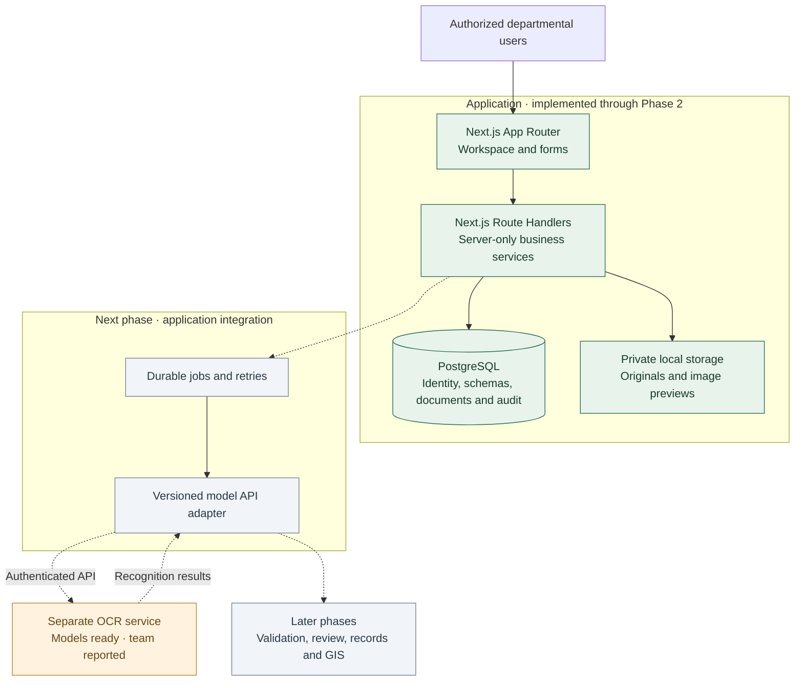
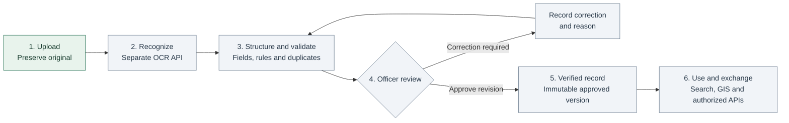

**SMART INDIA HACKATHON 2026 · TEAM SANGANAK**

# Intelligent Land Record Digitization and Validation System

### From legacy documents to traceable, verified digital records

**26018 · Smart Automation · Software**

Next.js frontend & backend · PostgreSQL · Independent OCR model API

[Project README](README.md) · [Supplied presentation format](docs/SIH2026-IDEA-Presentation-Format.pptx.pdf)

---

## Title page · Project identity

| SIH submission field | Project information |
|---|---|
| Problem Statement ID | **26018** |
| Problem Statement Title | Intelligent Land Record Digitization and Validation System |
| Theme | Smart Automation |
| PS Category | Software |
| Team Name | **Sanganak** |
| Team ID | Not supplied in the presentation template |

Identity and section order follow the supplied [SIH 2026 idea presentation format](docs/SIH2026-IDEA-Presentation-Format.pptx.pdf). This document contains presentation content organized around the six supplied SIH sections. Use README.md for the complete project guide. This is presentation source material, not an edited PowerPoint file.

> **Current position:** Application Phases 1 and 2 are complete. The team reports that its trained OCR models are ready in the separate model project. Connecting that service to this application is the next phase; application-level OCR results and end-to-end accuracy have not yet been verified.

## 01 · Idea title

### A source-backed workspace for land record digitization

Historical land records contain scanned pages, handwritten entries and inconsistent formats. Transcribing these into usable records requires more than recognizing text: officials must check the source, resolve inconsistencies and retain a history of decisions.

Our proposed solution brings **document preservation, OCR-assisted data capture, validation and accountable officer review** into one departmental workspace. A separately hosted OCR service supplies recognition results; the Next.js application manages access, structured records, review and integration workflows.

| Problem | Proposed response |
|---|---|
| Original evidence is difficult to trace | Preserve private source files and link each document to its location and history |
| Manual transcription is repetitive | Use the team's separate OCR service to assist text capture |
| Different record types need different fields | Configure versioned schemas for each document type |
| Recognition can be incomplete or wrong | Compare candidate values with source evidence and require human decisions |
| Corrections and approvals need accountability | Retain revisions, reasons and audit events |
| Digitized records need to remain useful | Build scoped search, reviewed GIS links and authorized exchange in later phases |

**What distinguishes the approach**

- **Evidence stays attached:** the original remains available alongside the document's metadata and history.
- **Models remain independently reusable:** OCR is accessed through an API, so it can evolve and serve other clients separately.
- **Schemas evolve without rewriting history:** an upload keeps its selected schema version when administrators publish new definitions.
- **Officers retain decision authority:** recognition confidence is a review signal; it never grants approval.

## 02 · Technical approach

### Architecture and ownership

**Next.js owns both the frontend and application backend. PostgreSQL owns application data. OCR runs in a separate deployment.** Model weights, training code and inference internals are outside this repository.

Solid connections show the current application. Dashed connections show planned integration. The OCR readiness statement refers to the separate model project, not an already connected application pipeline.

### Methodology · document to verified record

Step 1 is implemented. Steps 2–6 describe the planned application workflow. Processing will use durable jobs so that a browser disconnect or request timeout does not lose work. Results must pass identity, revision and output validation before the application accepts them.

### Technology and delivery status

| Layer | Technology / approach | Status |
|---|---|---|
| Frontend and backend | Next.js App Router, Route Handlers, TypeScript | Implemented |
| UI | React and Tailwind CSS | Implemented |
| Database | PostgreSQL, Drizzle, reviewed SQL migrations | Implemented |
| Access and traceability | Scoped RBAC, sessions, CSRF protection, audit | Implemented |
| Document intake | Private local storage, PDF/image previews, metadata history | Implemented |
| Schema configuration | Zod contracts and versioned JSON Schema | Implemented |
| OCR models | Independently maintained model project | Ready, reported by the team |
| Application-to-model connection | Authenticated API adapter and durable jobs | Next phase |
| Spatial records | PostGIS and map interface | Planned |
| Government exchange | Authorized, versioned integration adapters | Planned; no live connection |

**Verified application baseline:** 21 PostgreSQL integration tests and 6 Chrome browser scenarios passed at Phase 2 completion. Build, TypeScript, lint and the configured-secret client scan also passed. These checks validate the application features; they are not OCR accuracy measurements.

### Modular implementation

| Area | Modules | Delivery |
|---|---|---|
| Access and configuration | `identity`, `master-data`, `document-types`, `audit` | Implemented |
| Source documents | `documents` | Implemented |
| Model coordination | `processing` | Next phase |
| Quality and decisions | `validation`, `duplicates`, `verification` | Planned |
| Records and exchange | `land-records`, `gis`, `integrations` | Planned |
| Oversight and learning | `dashboard`, `feedback` | Planned |

## 03 · Feasibility and viability

### Why the implementation is feasible

The project already has a working access-controlled document workspace and PostgreSQL foundation. The separate OCR models are reported ready, allowing the next development stage to focus on API integration and reliable job handling. Module boundaries let the application and model teams develop and deploy independently.

The current prototype runs with one Next.js process, PostgreSQL and persistent private local storage. Inference hardware and service capacity belong to the separate model deployment and must be confirmed during integration.

| Challenge / risk | Response and next validation |
|---|---|
| Faded, mixed or handwritten source documents | Evaluate the OCR service on representative land records; route uncertain results to review |
| Model timeout, outage or repeated delivery | Add durable jobs, bounded retries and idempotent result ingestion |
| Incorrect field mapping or conflicting values | Validate against the pinned schema and domain rules; preserve evidence and corrections |
| Sensitive records exposed outside their jurisdiction | Enforce permissions in services and private file endpoints; retain access audit |
| Host failure or growing document volume | Back up database and files together; validate restore and add shared storage before scaling |
| Government interfaces unavailable | Use clearly labelled mocks until authorized interfaces and mappings are supplied |

**Current limits:** local storage is intended for a persistent single-host prototype. Production scanning/quarantine, stronger parser isolation, shared storage, backup/restore validation and operational hardening remain deployment work. Field extraction, verification, GIS and government exchange are not yet connected workflows.

## 04 · Impact and benefits

### Intended beneficiaries

Revenue and land-record departments, document operators, verification officers, GIS/data officers and supervisors are the primary users. Citizens may benefit indirectly through clearer, more traceable administrative records and services.

| Benefit | Intended outcome | How to evaluate it |
|---|---|---|
| Operational | Reduce repeated transcription and retrieval effort | Time per document and officer correction workload |
| Administrative | Make source evidence and decisions traceable | Completeness of source links, revisions and audit history |
| Social | Support clearer records and accountable handling | Resolution time and quality of reviewed cases |
| Economic | Reduce avoidable rework in digitization | Cost per verified record, including review and inference |
| Environmental | Reduce unnecessary printing and physical file movement | Print volume and physical handoffs before and after adoption |
| Planning | Enable later search and reviewed spatial use | Retrieval success and independently verified parcel links |

These are intended benefits, not measured deployment outcomes. OCR quality will be evaluated against verified ground truth, separately from confidence scores and application test results.

## 05 · Research and references

| Source | Use in this project |
|---|---|
| [Supplied SIH 2026 presentation format](docs/SIH2026-IDEA-Presentation-Format.pptx.pdf) | Submission identity and the six presentation sections |
| [Project capability baseline](MASTER_PROJECT_PROMPT_SIH26018.md) | Problem context, requirements and intended workflows |
| [Architecture and technical references](docs/ARCHITECTURE.md) | Stack decisions, module boundaries and supporting references |
| [Phase 2 implementation and verification](docs/PHASE_2.md) | Working prototype, test evidence, limits and walkthrough |
| [Proposed model API contract](docs/MODEL_API_CONTRACT.md) | Application/model interface to align with the ready OCR service |
| [Security and privacy design](docs/SECURITY.md) | Authorization, source integrity and production considerations |

Model readiness is based on the team's latest update. Training details, classifier internals and standalone benchmark figures are intentionally outside this presentation. No end-to-end land-record accuracy or official endorsement is asserted.

