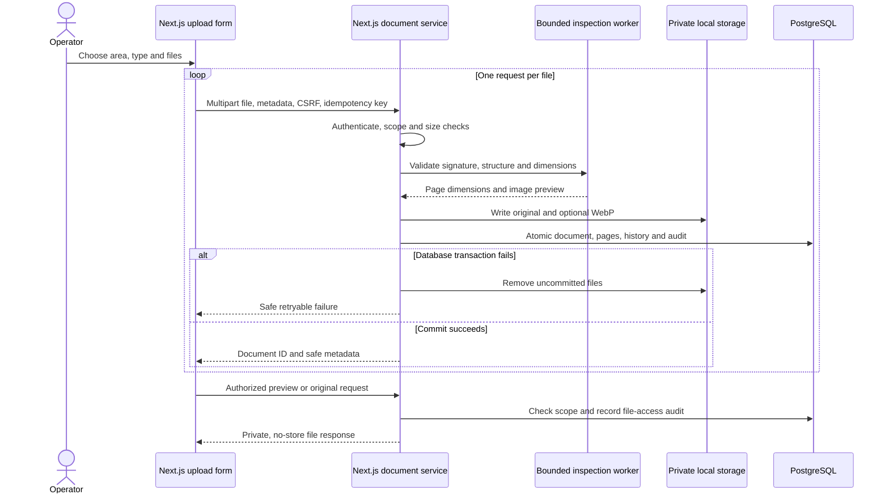

# Phase 2 — document intake and configuration

Next.js owns both the UI and application API. PostgreSQL persists document identity, schemas, hierarchy, metadata versions and audit. Originals and image previews use private local filesystem storage. Model inference and processing jobs are not part of this phase.

## Run and demonstrate

Use the prerequisites and isolated database setup in [DEPLOYMENT.md](DEPLOYMENT.md), then:

```powershell
npm ci
npm run db:local
npm run db:migrate
npm run db:seed
npm run fixtures
npm run dev
```

Open http://127.0.0.1:3000. Generated passwords are in ignored `.local-data/demo-accounts.json`.

1. Sign in as `admin@demo.land`. Open **Administrative areas** to add a village under an existing tehsil. States require all department scopes; districts use existing assigned jurisdiction scopes. Entries cannot be moved or deleted through the app.
2. Open **Document types**. Create a type with named fields or publish a new version of an existing type. Each field has a stable key, label, scalar type, required flag and critical flag. Publishing never replaces old versions.
3. Sign out and use `operator@demo.land`. Open **Upload documents**, select the synthetic state/NORTH district/tehsil/village, and optionally choose a document type. Upload the synthetic PDF and PNG from `.local-data/fixtures`.
4. Open the PDF, navigate pages, change zoom and download the unchanged original. Image previews are generated WebP images. Edit descriptive metadata with a reason and inspect both revisions in **Document history**.
5. Sign in as `external.admin@demo.land`: documents from the other department cannot be listed, opened, previewed or downloaded, even with their IDs.

Fixtures contain fictional English text only. They do not measure OCR, handwriting, multilingual extraction or accuracy.

## Implemented workflow



## Storage and limits

`STORAGE_PROVIDER=local` is the implemented adapter. `STORAGE_PATH` defaults to `.local-storage`, outside `public`. Generated keys contain no client paths and cannot overwrite an existing object. File bytes and storage keys are never included in document-list DTOs. Back up PostgreSQL and the private storage directory together.

Defaults and maximum accepted configuration: 25 MiB per file, 100 PDF pages, 20 files per UI selection. Uploads are one bounded multipart request per file, processed sequentially in the UI. Server upload attempts are limited to 30 per user per minute. Inspection allows two concurrent workers per web process, a 15-second deadline and a 128 MB JavaScript heap per worker. Native image buffers are also constrained by 40 million input pixels and 20,000-pixel dimensions. These are resource limits, not an antivirus guarantee or OS process sandbox.

Accepted formats: PDF, JPEG, PNG and single-page TIFF. The extension, claimed MIME and signature must agree; empty, corrupt, oversized and unsupported files are rejected. Password-protected PDFs and PDFs containing detected actions, scripts, XFA or embedded files are rejected. PDF previews use PDF.js canvas rendering without active HTML/annotation layers. Image previews are resized/reencoded without retaining source metadata. Original bytes are preserved unchanged and served as attachments on download.

Successful uploads stop at `UPLOADED`. No remote work is started. The browser retains per-file idempotency keys during retries on the current page; a repeated key with identical content returns the existing document, while changed content returns 409. A reload does not restore the browser batch. Independently uploaded identical files are allowed; duplicate analysis is a later phase.

## Integrity and permissions

All seeded roles have scoped `documents.read`; only operators have `documents.upload`. Only the uploader can edit title, language, reference and notes while the document remains uploaded. Every edit requires `expectedRevision` and a reason. Location, original, uploader and pinned schema are immutable. Unclassified uploads retain a null schema in this phase; reclassification needs a later explicit versioned workflow.

Administrators have `master-data.manage` and `document-types.manage`. Schema publication is department-scoped and requires `expectedVersion`. Administrative parent-child foreign keys enforce department consistency; district jurisdiction scopes control descendant access. Services recheck live permissions for mutations, and audit writes share their database transactions. Historical metadata, schema and status rows cannot be rewritten.

## Verification and operational boundaries

Verified on 2026-09-10: all 21 integration tests and six Chrome browser scenarios passed. Production build, TypeScript and ESLint passed. Client scan checked 21 JavaScript files without finding configured server secrets. Desktop/mobile screenshots were inspected.

`npm test` exercises PostgreSQL transactions, constraints, scoped queries, original bytes, file inspection, schema preservation, concurrent idempotency, metadata revision conflicts, multipart limits and audit/storage-failure cleanup. `npm run test:e2e` covers the browser flows and lost-response retry after `npm run build`. `npm run security:client` scans built client JavaScript for configured server secret values.

Local storage requires a persistent private directory and OS access controls for the web-process account. Ephemeral/serverless disks and multiple unshared web instances are unsupported. Deploy the inspection script and runtime parser dependencies, plus the generated `public/pdfjs` worker/fonts/CMaps copied by prebuild/predev. Do not expose the private storage directory through a web server.

Production antivirus/quarantine, OS-isolated parser services, storage encryption/backup restore tests, S3/shared storage, orphan-file reconciliation after process crashes, retention policy and proxy-level request limits remain deployment work. A handled failed transaction removes files; a process crash between filesystem writes and database commit can leave inaccessible orphan files. No production-security certification is claimed.

The next phase is durable processing jobs and the separately hosted model API contract/adapter, subject to the user's instruction to proceed.
