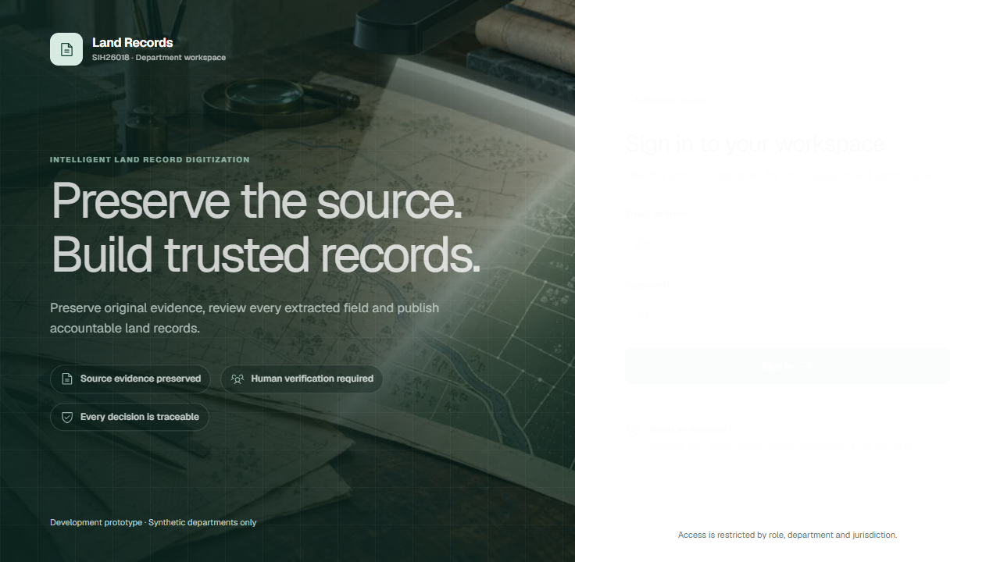
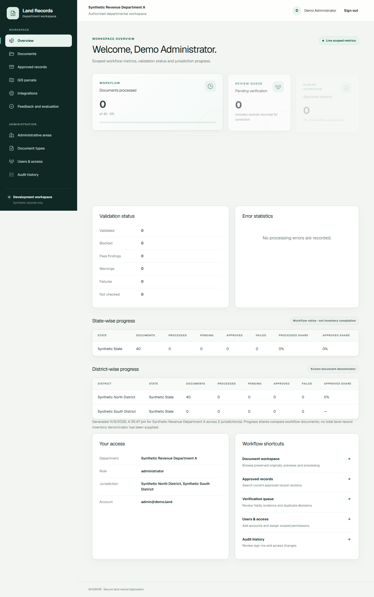
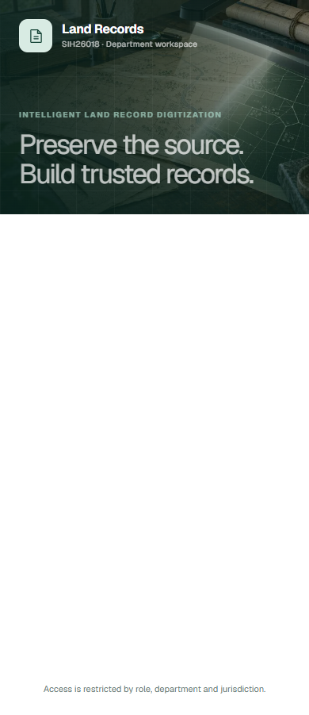
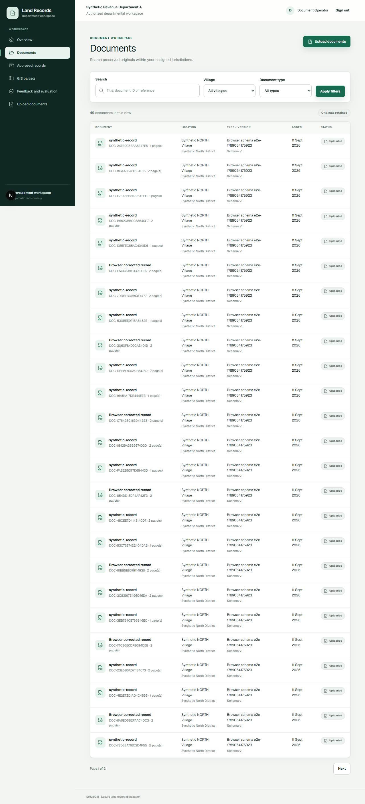
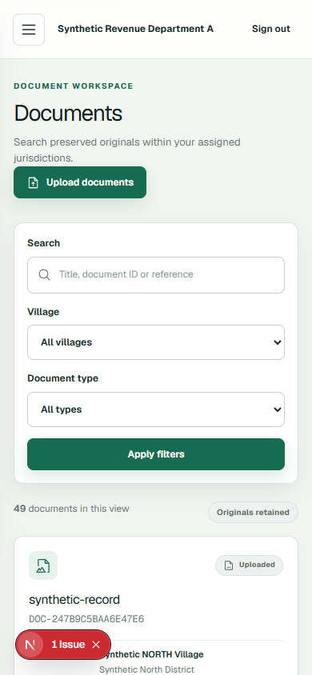

# UI Redesign Implementation Record

Status: Foundation slice complete; module screens in progress  
Started: 11 September 2026  
Design specification: [UI_REDESIGN_PLAN.md](./UI_REDESIGN_PLAN.md)

This record documents the redesign in reviewable steps. Product behavior, authorization checks, routes and data contracts remain unchanged unless a step explicitly says otherwise.

## Step 1: Audit the implemented product

Completed on 11 September 2026.

- Reviewed the current application instead of treating the earlier Phase 2 scope as the present product.
- Confirmed that the workspace includes dashboards, documents, verification, approved records, GIS, integrations, feedback, administration and audit features through Phase 11.
- Preserved permission-based navigation and server-side authorization.
- Selected a restrained public-sector design direction: ink navy, forest green, paper neutrals, clear status colors and compact operational typography.

## Step 2: Establish the visual foundation

Completed on 11 September 2026.

- Replaced the earlier ad hoc color and spacing values with semantic CSS tokens.
- Added self-hosted Geist Sans and Geist Mono through the `geist` package so production builds do not depend on Google Fonts.
- Added common focus, form, table, panel, responsive and reduced-motion behavior.
- Kept existing shared class names so every implemented module receives the new visual system without changing its business behavior.

## Step 3: Add the component and motion layer

Completed on 11 September 2026.

- Added Phosphor as the single icon family. The interface does not use emoji as icons.
- Added an owned `BentoGrid` and `BentoCard` pattern inspired by Magic UI for operational metrics.
- Added owned `AnimatedContent` and `CountUp` patterns inspired by React Bits.
- Motion uses `motion/react`, is limited to transform and opacity, and respects `prefers-reduced-motion`.
- Animation remains inside client leaf components; authenticated pages and data loading remain server-rendered.

## Step 4: Redesign the application shell

Completed on 11 September 2026.

- Split navigation into Workspace and Administration groups.
- Added role-aware Phosphor icons and a clear active route state.
- Added a sticky translucent header with department and account context.
- Added an accessible mobile drawer with explicit open and close controls.
- Updated the environment marker to identify synthetic development data without referring to an obsolete phase number.

## Step 5: Redesign sign-in and add an original image

Completed on 11 September 2026.

- Redesigned sign-in as an editorial split layout with a compact accessible form.
- Added field icons, loading state motion and a clearer restricted-access note.
- Generated and saved [land-record-digitization.png](../public/images/land-record-digitization.png) for this application.
- The visual contains fictional archival map material and no names, addresses, signatures, seals, logos, emblems or personal data.

Image tool: built-in image generation.

Final prompt summary: A professional editorial scene showing fictional cadastral sheets and an archival register under a document scanner, transitioning into precise digital geometry. The requested palette was ink navy, forest green, parchment and warm stone, with no text, logos, seals, personal data, neon or science-fiction motifs.

## Step 6: Redesign the operational dashboard

Completed on 11 September 2026.

- Converted the primary workflow indicators into a responsive bento composition.
- Added purpose-specific icons, restrained count-up motion and a processed-share progress indicator.
- Kept model confidence explicitly separate from extraction accuracy.
- Preserved state and district tables, validation counts, error statistics, workflow shortcuts and access details.

## Step 7: Verification

Completed on 11 September 2026 for the foundation slice.

- `npm run typecheck`: passed.
- `npm run lint`: passed.
- `npm run build`: passed after replacing network-fetched Google fonts with the self-hosted Geist package.
- Desktop login, dashboard, mobile login and mobile navigation were inspected in a real browser.
- Corrected a narrow-card overflow found during desktop inspection.
- Kept animated content visible in its initial render so automated captures and slower devices never show blank panels before hydration.
- `npm test`: all 25 PostgreSQL integration tests passed.
- `npm run security:client`: checked 28 client build files; configured server secrets were not found.
- `npm run test:e2e`: all 6 Chrome scenarios passed outside the Windows sandbox, including mobile overflow coverage.

### Browser captures

## Next implementation slice

## Step 8: Redesign the document list

Completed on 11 September 2026.

- Added a sticky desktop filter surface for search, village and document type with a contextual Clear action.
- Added PDF/image icons and text-plus-icon status badges with neutral, information, warning, success and danger treatments.
- Added the document creation date while preserving the original ID, page count, location and pinned schema information.
- Replaced the desktop table below 768px with labeled document cards and one clear Open document action.
- Added table-row and card `focus-within` treatments; selected rows have a supported `aria-selected` visual state for future selection workflows.
- Added a route-specific skeleton that reserves the page heading, filter and result-table dimensions.
- Added distinct no-data and no-filter-result empty states. Upload is offered only to authorized users, and filter recovery appears only when filters are active.
- Verified a 390px viewport has no horizontal overflow and visually inspected desktop, mobile and zero-result layouts.
- The focused document browser suite passed all 3 scenarios after the redesign.

### Document list captures

## Next implementation slice

1. Redesign the document detail workspace, including preview, history, extraction and validation states.
2. Convert upload intake into a clear staged workflow with progress, per-file outcomes and recovery states.
3. Redesign the verification workbench around evidence, field decisions, corrections and approval readiness.
4. Redesign records, GIS, integrations and feedback around their operational tasks and status models.
5. Redesign administration and audit views, then perform the final cross-role responsive and accessibility audit.
